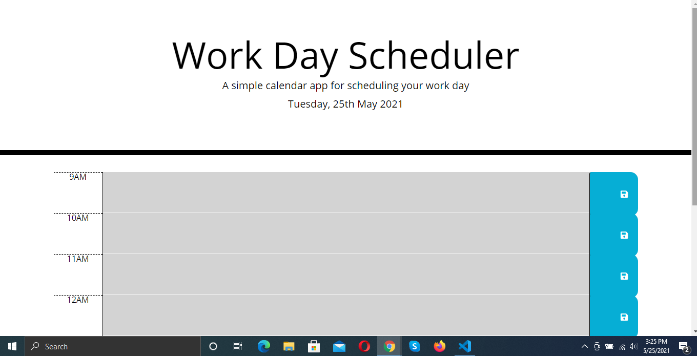
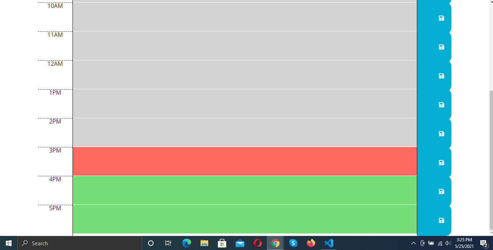

# Work-Day-Scheduler

This application allows you to write down and save tasks for 9AM to 5PM of the current day and then updates the page to reflect time that has already passed, the current time, and time that has not yet passed.

## Installation

Simply go to https://acdecastro.github.io/Work-Day-Scheduler/ to see the webpage in action.

The code for this application can be seen at https://github.com/ACDecastro/Work-Day-Scheduler

## Usage

When the user first navigates to the page, they will be faced with this screen. The date displayed on the page automatically updates to display the current date.

If the user scrolls down, they will see a series of time slots. Each time slot shows the time it refers to on the left, a text field in the middle, and a save button on the right. If the time of a time slot has passed, it will turn grey. If the hour of the present time matches that of a time slot, that slot will turn red (ex. If the current time is 10:35AM, the 10AM time slot will turn red). If the time of a time slot has not yet passed, the slot will appear green.

The user can type description of tasks into the text fields. If the user then clicks the save button directly adjacent to the text field, that description will be saved in local storage. That description will persist even if the user refreshes the page, navigates to a different webpage, or closes the window. When the user returns to the application using the same browser, they will find their task description are still on the page.